# Tidy

**Team:** Er Rui Xian, Ho Wan Zhen, Hans Kim Qin Duan, Ong Zi Rui.  
**Problem Statement:** Stress & Workload Manager.   
**Video Presentation:**  [https://youtu.be/2WJzPt55qns?si=oSkXS0_O-zssUMlS](https://youtu.be/2WJzPt55qns?si=oSkXS0_O-zssUMlS).     
**Presentation Slides:** [https://canva.link/qmigoi7tq8240jg](https://canva.link/qmigoi7tq8240jg). 
## 1. Project Overview
Tidy is a student-centred workload and burnout-prevention application that helps university students understand their workload before they become overwhelmed. Tidy begins with an onboarding baseline and gradually improves its understanding through AI conversations and behavioural patterns. This information is used to refine the user’s capacity score, predict overload and provide increasingly personalised schedule and recovery recommendations. 

The onboarding questions establish the user’s initial baseline. As the user continues interacting with the AI, Tidy gradually refines this baseline by observing patterns such as how frequently commitments are rescheduled, how often the user reports stress and how their mood changes over time. When overload is predicted, the system explains the causes and recommends schedule or recovery actions that users can accept, adjust, or reject.

### 1.1 Problem Context
University students always manage examinations, assignments, club activities, assignments, social commitments, errands, and personal responsibilities at the same time. Burnout is rarely caused by one major event; it develops when these demands accumulate across different parts of life without students recognising how close they are to their personal capacity. Burnout is not merely a short-term reaction to heavy workloads, but a cumulative state of exhaustion that develops when pressure remains high without adequate mental recovery. Research indicates that 60% to 80% of college students experience academic burnout, exacerbated by a lack of situational awareness regarding their true cognitive and physical capacity.Students default to unchecked overcommitment, pushing back lower-urgency tasks until cognitive overload occurs. 
The main causes include:
- Overlapping deadlines and back-to-back commitments
- Poor visibility of total workload across different life areas
- Procrastination and repeated postponement of difficult tasks
- Accepting new commitments without considering existing workload
- Insufficient sleep, breaks and recovery time
- Different stress tolerances, energy levels and lifestyles
- Productivity tools that focus on task completion rather than well-being
As a result, students may only recognise the problem after becoming overwhelmed, leading to missed deadlines, reduced academic performance, sleep disruption, social withdrawal and declining well-being.

### 1.2 Limitations of Existing Solution
Existing market solutions generally separate productivity management from wellness support. 

| Existing Application                      | Problem                                                                                                                                                                                           |
| ----------------------------------------- | ------------------------------------------------------------------------------------------------------------------------------------------------------------------------------------------------- |
| Google calendar, Notion, Todoist, Catflow | Support scheduling and task organisation, but their core experiences do not produce a personalised stress-risk consideration using the student’s mood, behavioural patterns and personal capacity |
| Motion                                    | Uses AI to organise tasks and schedules, but primarily focuses on time and productivity rather than student-specific burnout prevention, and conversational well-being patterns.                  |
| Calm and Headspace                        | Only provides meditation, sleep and stress-management activities, but it does not analyse the user’s academic workload or rearrange the schedule causing the overload.                            |
Students therefore lack one connected platform that can identify the source of overload, explain the risk, recommend schedule changes and guide them towards appropriate recovery. 

### 1.3 Stakeholder Analysis

| Stakeholder                             | Role and Interest                                                     | Main needs or concerns                                                                 |
| --------------------------------------- | --------------------------------------------------------------------- | -------------------------------------------------------------------------------------- |
| University students               | Primary users managing academic and personal commitments.             | Simple workload overview, early warnings, realistic suggestions, privacy and control.  |
| Working students and student caregivers | Students managing additional responsibilities.                        | Flexible scheduling that considers limited time and energy                             |
| Employees and working adults      | Potential secondary users with similar workload-management challenges | Support for balancing professional and personal commitments                            |
| Development team                        | Builds and maintains the system                                       | Realistic scope, accurate synchronization, security and maintainable technology.       |
| Google services                         | Provide authentication, and schedule integration                      | Secure authorization and responsible use of user data                                  |

### 1.4 Target Users
- **Primary Users**
	Tidy primarily targets university students aged approximately 18–25 who manage multiple academic and personal responsibilities.
	It is relevant to:
	- Students with several overlapping modules and deadlines.
	- Students working part-time.
	- Students involved in clubs, sports or extracurricular activities.
	- Students who commute or have family responsibilities.
	- Students who frequently procrastinate or struggle to estimate their capacity.
	- Students whose mood, sleep and energy affect their ability to complete work.
- **Secondary Users**
	Tidy may later be adapted for employees and working adults who manage multiple professional and personal responsibilities.
	It is relevant to:
	- Employees managing multiple deadlines, meetings and projects.
	- Interns adapting to new responsibilities and working schedules.
	- Freelancers balancing different projects and clients.
	- Working adults managing employment, family, errands and personal commitments.
	- Individuals who struggle to balance productivity, stress and recovery.
	The MVP remains focused on university students to ensure that its workload model, language and recommendations are designed for one clearly defined user group.

### 1.5 Proposed Solution
Tidy is a mobile stress and workload management application that gives university students one clear view of their academic, personal and social demands. It combines a student’s tasks and events with their stress tolerance, lifestyle preferences, mood, sleep and energy to calculate a personalised predicted stress-risk and capacity score. The AI conducts conversational well-being check-ins and gradually refines the user’s profile using relevant conversations and behavioural patterns. When upcoming overload is identified, Tidy explains the causes and provides schedule or recovery suggestions that remain under the user’s control. 

Tidy does not diagnose stress or replace professional mental-health support. Its purpose is to provide early awareness, practical workload management and appropriate recovery guidance.

### 1.6 Feature Set
1) Personalised Onboarding
	- Establishes the user’s initial stress tolerance and procrastination tendency.
	- Collects lifestyle preferences such as preferred working hours, session length, sleep and break preferences.
	- Creates an initial baseline instead of applying the same workload limit to every user.
2) Google Calendar Integration
	- Provides secure sign-in through Google OAuth.
	- Imports existing classes, events and commitments.
	- Synchronises approved schedule changes with Google Calendar.
3) Smart Task and Event Management
	- Allows users to add, edit, complete and delete tasks or events.
	- Captures priority, deadline,and workload category.
	- Supports voice input for faster and more accessible task creation.
	- Organises daily commitments into morning, afternoon and night.
4) Conversational Well-Being Check-In
	- Allows the AI to ask, “How are you feeling today?” when the user first opens the application each day.
	- May ask relevant follow-up questions about mood, stress, sleep or energy.
	- Stores each check-in with its date and time to identify recent patterns.
	- Avoids repeatedly asking the same question every time the application is opened.
5) Five-Dimensional Workload Visualiser
	- Categorises workload into:
		- Mental
		- Time
		- Physical
		- Social
		- Errands
	- Shows which area is contributing most to the user’s overload.
6) Conversational Memory with Vector Database
	- Stores embeddings or summaries of relevant AI conversations in a vector database.
	- Retrieves related past conversations when answering new questions.
	- Helps the AI remember previous concerns, preferences and workload patterns.
7) Personalised Stress-Risk Calculation
	- Combines the user’s personal baseline, current well-being and scheduled workload.
	- Consider deadlines, task effort, duration, urgency, back-to-back events and insufficient breaks.
	- Presents the result as a predicted risk indicator rather than a medical diagnosis.
8) Pre-Commitment Stress Check
	- Evaluates the effect of a new task or event before it is confirmed.
	- Warns users when an additional commitment may overload their schedule.
	- Shows the expected effect, such as:
	- “Adding this task may increase Thursday’s capacity from 76% to 92%.”
9) Explainable Overload Forecast
	- Predicts upcoming high-risk periods before the user becomes overwhelmed.
	- Detects multiple deadlines, repeated postponement, inadequate recovery and worsening conversational check-ins.
	- Identifies the commitments and behavioural patterns contributing to the risk.
10) AI Schedule Optimisation
	 - Suggests moving flexible or lower-priority tasks.  
	* Breaks large assignments into smaller and more manageable sessions.  
	* Adds suitable breaks between demanding commitments.  
	* Provides alternative suggestions when the first option is unsuitable.  
	* Shows a before-and-after schedule comparison.
11) User-Controlled Changes
	* Allows users to review all AI recommendations.  
	* Lets users accept, reject or manually adjust suggested changes.  
	* Allows users to revert previously accepted changes.
12) Proactive Stress Alerts
	* Notifies users when future workload is predicted to exceed their capacity.  
	* Encourages action before the stress level becomes critical.
13) Personalised Recovery Support
	* Recommended activities or guides are provided.  
	* May recommend breathing exercises, stretching, walking, resting, sleeping or connecting with a friend.
14) Progress Dashboard
	* Displays overall and category-specific workload levels.  
	* Helps users understand whether their workload balance is improving.  
	* Provides personalised recommendations based on recent behaviour.
15) Conversational AI Schedule Assistant
	* Allows users to ask questions about their schedule using natural language.  
	* Supports questions such as, “Can I take an additional work shift tomorrow?”  
	* Analyses commitments, conflicts, deadlines, recent well-being and relevant conversation history.  
	* Explains how a new commitment may affect the user’s capacity.  
	* Allows the user to accept, adjust or decline the recommendation.
As a result, Tidy helps users optimise their schedules and reduces the risk of feeling overwhelmed. Tasks and events are organised according to the user’s workload, mood and personal capacity, allowing them to focus on the right priorities and complete important work before deadlines. 
## 2. Ideation and Process
### **2.1 Ideas**
- **Accepted Ideas**

| **Idea**                                              | **Why it was kept**                                                                                                                                                                              |
| ----------------------------------------------------- | ------------------------------------------------------------------------------------------------------------------------------------------------------------------------------------------------ |
| Task rescheduling suggestion                          | Reduces mental overhead required from users during a task rescheduling, allowing them to easily move tasks to a later day whilst being confident that they still have time to complete it later. |
| Stress score checking during task scheduling          | Prevents users from scheduling tasks/events that collide or otherwise cause tiredness/burnout.                                                                                                   |
| Stress score calculation and guided relaxations       | Daily stress score allows AI to determine whether adding a task to a given day may overwhelm a user.   Guided relaxation provides grounding and relaxation to users in high stress days.   |
| Profile establishment during app onboarding           | Responses to onboarding questions acts as a baseline value to be referenced from AI to provide personalised rescheduling suggestions and accurate stress score calculations.                     |
| Periodic well-being check-ins in AI chat              | The user's recent well-being allows AI to better determine a user's load capacity for a given day.                                                                                               |
| Contextual AI chat with persistent memory             | Allow the app's rescheduling suggestions to cater more towards a user's preferences, whilst making stress score calculations more accurate for users.                                            |
| AI chat panel serving as a user's primary entry point | Reduces cognitive load of users when using the app as tasks can be carried out using natural language.                                                                                           |
 - **Rejected Ideas**

| **Idea**                                                             | **Why it was dropped**                                                                                                                                                                                                                                                                                                                                                                                                                                                               |
| -------------------------------------------------------------------- | ------------------------------------------------------------------------------------------------------------------------------------------------------------------------------------------------------------------------------------------------------------------------------------------------------------------------------------------------------------------------------------------------------------------------------------------------------------------------------------ |
| Interactive calendar view for scheduled tasks/events                 | There are plenty of well-established products that provide similar services, this feature does not make our product unique. Existing products include Notion Calendar, Google Calendar, Apple Calendar .etc  Instead of competing with existing calendars, we provide the functionality of our application whilst allowing users to still be using their preferred calendar app, reducing onboarding friction.                                                                 |
| Historical mood tracker that logs each mood entry provided by a user | Storing a log of mood entries does not align with our app’s core functionality of managing a student’s task and stress levels, and instead shifts our app to be more of an emotion/journalling app  Mood entries will only be used at the time of change itself for the AI to calculate a more personalised/accurate stress score alongside better rescheduling suggestions                                                                                                    |
| Focus timer for study sessions                                       | Focus timer implementations have been widely implemented across dedicated apps, social channels and OS level tools.  A focus timer shifts our app towards policing how a student studies minute-by-minute rather than preventing academic burnout before it happens.   Introducing such a feature introduces feature bloat that diverges from the main goal of the application, which also does not help in making our application different from existing applications. |
### 2.2 Ideation Boards
1) **AI Chatting User Flow**
 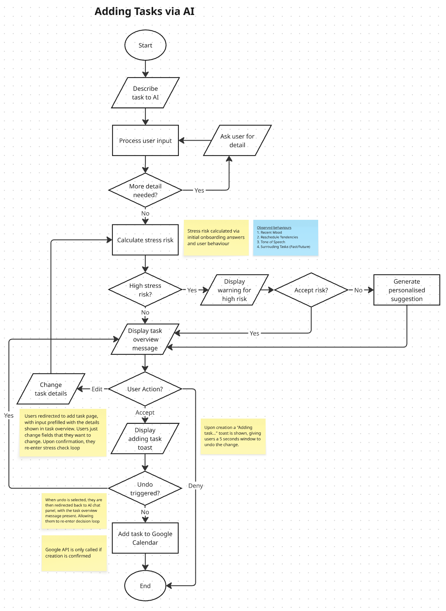
This flow chart illustrates the interaction of a user with the in-app AI chat. The interactions listed here would mostly take place within the AI chat panel itself, with dynamic message widgets that handles user interactions.
2) **Task/Events Fetching User Flow**
 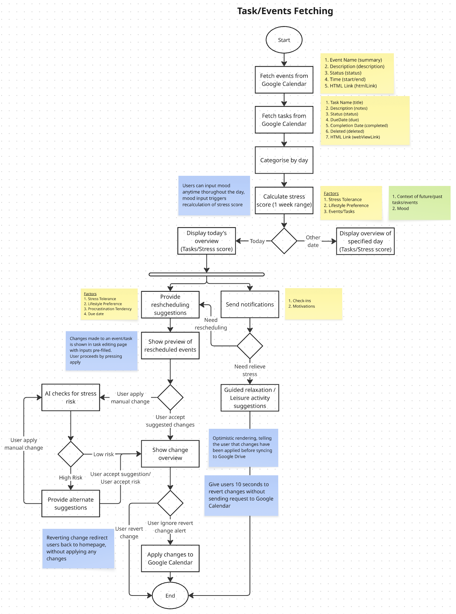
This flow chart illustrates the fetching of events and tasks from Google Calendar. It highlights the flow of core features within our app, including stress score calculations, task rescheduling suggestions and guided relaxations.

**Other flow charts that have been created to visualise our app's flow can be found in the following link:** [Miro Board](https://miro.com/app/board/uXjVHrxLcGc=/?share_link_id=632907770894) 
### 2.3 Mentor Feedback

| **Date**                      | **Mentor**    | **Feedback Received**                                                                                                                                                         | **What Was Changed**                                                                                                                                            |
| ----------------------------- | ------------- | ----------------------------------------------------------------------------------------------------------------------------------------------------------------------------- | --------------------------------------------------------------------------------------------------------------------------------------------------------------- |
| 3 September 2026 21:15  | Khor Jia Quan | Personalised / Context-driven AI suggestions and stress calculations is something unique                                                                                      | Scope of application is focused on differentiating features (Personalisation of suggestions and stress calculation / AI chat panel) instead of generic features |
|                               |               | Prepare UI snapshots for better illustration of idea to allow for further feedbacks by mentors                                                                                | -                                                                                                                                                               |
| 9 September 2026 21:45  | Zach Kong     | Emphasise on the functionality of the AI chat panel, better integrating it into the application to allow users to use it as a primary method to interact with the application | Pre-existing UI is redesigned to complement the AI chat feature more, allowing smoother UX via the AI chat panel                                          |
|                               |               | Configuring AI chat to have contextual awareness and long-term memory to provide users with a more personalised experience                                                    | AI suggestions and stress calculations adapt to ongoing user behaviour and mood, using onboarding responses only as a baseline.                                 |
|                               |               | Mood input can be handled by the AI chat instead as moods are difficult to quantify objectively                                                                               | The rigid mood selection menu is replaced with periodic AI check-ins                                                                                      |
|                               |               | Abstracting the separation between Google Tasks and Google Events within our application since both task and event types have similar data fields                             | Task and event creation are no longer separated into distinct tabs. The appropriate API is now determined automatically from user input.                     |

# 3. Design and Prototype
### 3.1 Prototype
[UI Prototype Figma](https://www.figma.com/design/0b5Y3VsY3MJ0oPD9mThIma/SC-CodeNection?node-id=0-1&t=QV9GF6yAXxzAxAvY-1)

**Key Screens:**
1) **Homepage**  
   The homepage provides users with an immediate overview of their current workload and schedule. The AI Assistant is placed prominently at the top to provide personalised insights and can lead users directly into the AI Chat. Below it, the stress level section is broken down into five areas: Mental, Time, Physical, Social, and Errands. When the user's workload exceeds their personal limit, a "Rebalance Today" card appears, explaining the cause of the overload (e.g. "Stats revision is pushing today over the edge") and prompting the user to view rescheduling options via the Suggestions page. Today's Plan gives users a quick view of their upcoming commitments pulled from their Google Calendar and Google Tasks.  
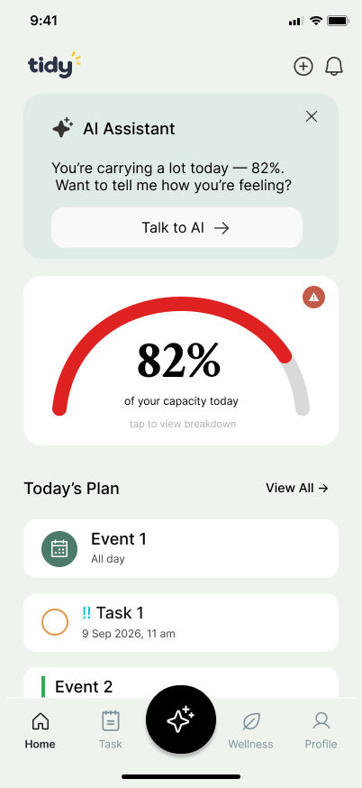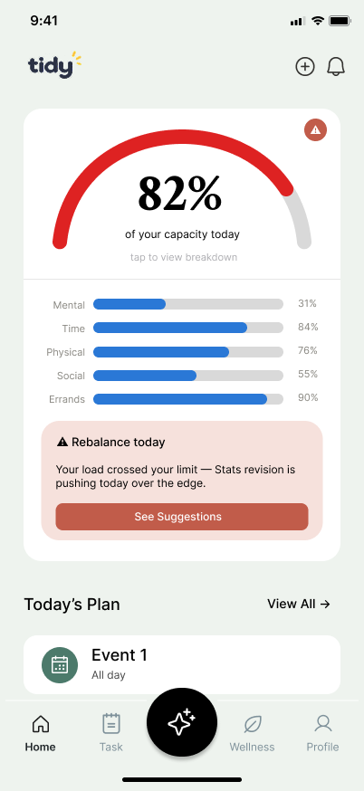
2) **Task**  
   The Task page allows users to organise and manage their commitments throughout the day. Tasks are grouped into categories and can be expanded for more detail, while completed tasks are separated into their own section to help users keep track of progress without cluttering the active list.  
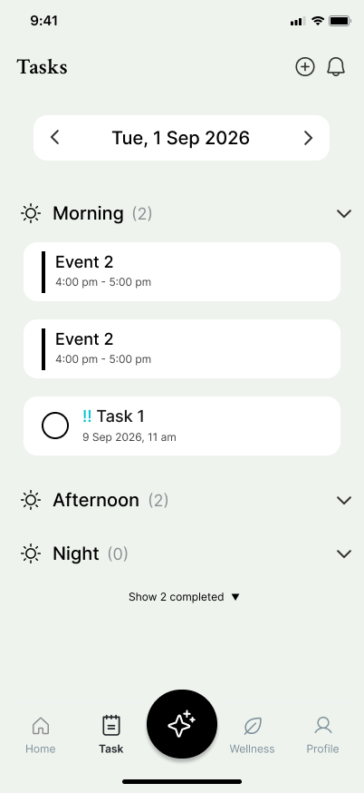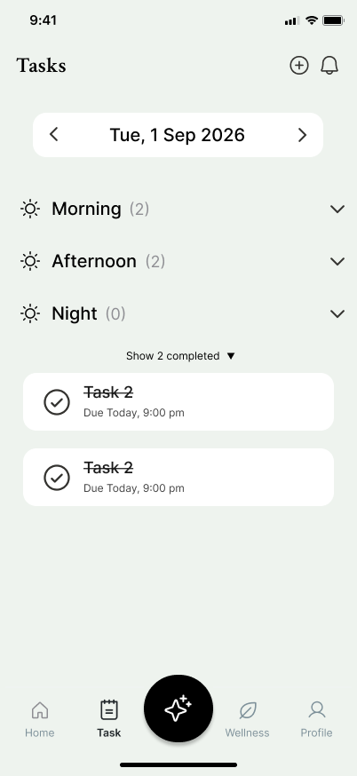
3) **Add Task**
   The Add to Schedule page provides a unified way to add new commitments without requiring users to distinguish between tasks and events. Tidy uses the information provided, such as timing and deadlines, to determine how the commitment should be handled. For example, a specific start/end time behaves as an event, while a deadline alone behaves as a task. Users can also fill in the form using voice input via a floating action button (FAB), in addition to manual entry. This same page is also used when editing a commitment suggested through the AI Chat, in which case the fields are pre-filled based on what the user described, so they only need to review or adjust the details rather than start from scratch.  
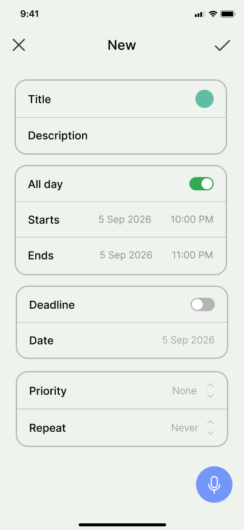
4) **Alert**  
   When a new or edited commitment would push the user's workload beyond their personal threshold, Tidy surfaces an alert before the change is confirmed. The alert shows the resulting change in workload percentage along with the specific reason for the overload, such as overlapping deadlines, so users understand exactly why they're being flagged rather than receiving a generic warning. From here, users can choose to add the commitment anyway or view rescheduling suggestions instead.   
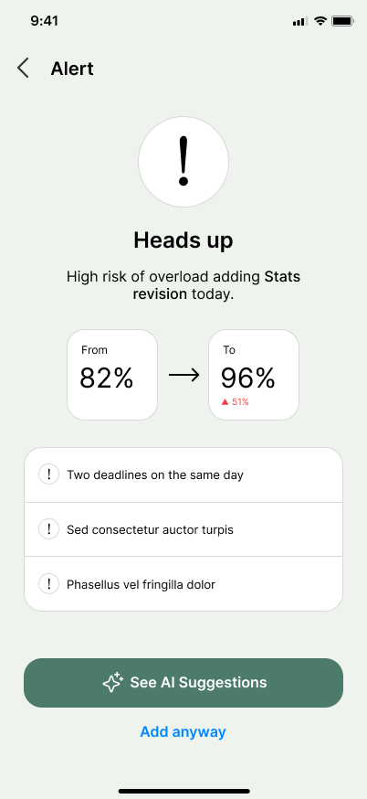

5) **Suggestion**  
   From an overload alert or the homepage's rebalance card, users can view rescheduling suggestions to help resolve the overload. Each suggestion is presented as an option that can be expanded to show exactly what would change, including the original and proposed date or time, allowing users to clearly understand the impact of each option before deciding rather than applying a change blindly. Users can apply a suggestion directly, or choose to edit it further before confirming.  
   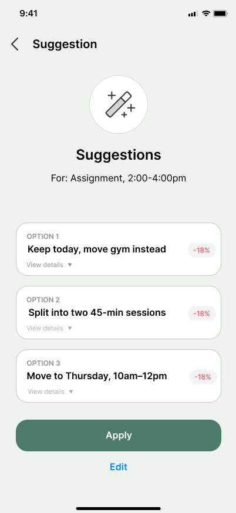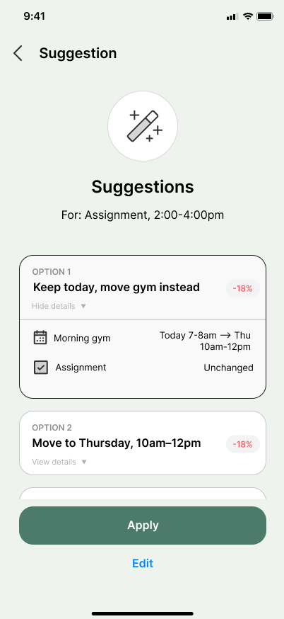
6) **AI Chat**  
   The AI Chat is the main interaction point of Tidy, allowing users to manage their workload through natural language. Users can describe commitments, check their workload, or seek recommendations. For example, a plain-language message such as "I have a birthday party tomorrow from 7 to 9pm" is parsed directly into an event preview card with Approve, Edit, or Decline actions. Approve adds the commitment directly to the user's calendar, Edit redirects to the prefilled Add to Schedule page for further adjustment, and Decline dismisses the commitment while having Tidy draft a ready-to-send message on the user's behalf rather than simply discarding the request. Users can also check in with Tidy about how they are feeling, allowing mood information to support more personalised recommendations.  
   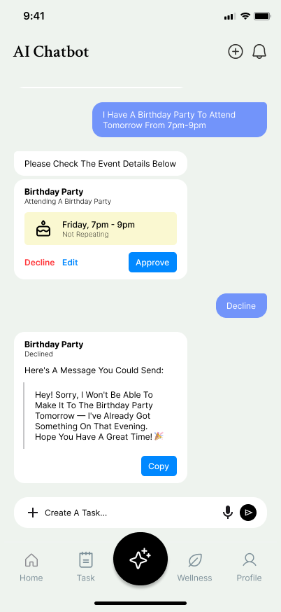
8) **Wellness**  
   The Wellness page provides recovery support through categories such as Quick Relief, Music, Sleep & Wind Down, and Move & Refresh, each linked to guided videos users can follow along with. These resources give users simple, low-effort ways to recover when they are feeling stressed or overloaded, without introducing additional tasks, scores, or streaks to maintain.  
   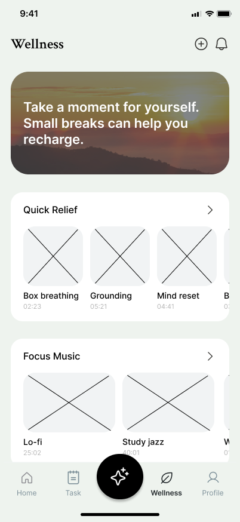
# 4. What Makes It Different
Tidy’s originality comes from connecting productivity and wellness into one prevention cycle. Instead of only organising tasks or offering general relaxation activities,Tidy begins with an onboarding baseline and gradually improves its understanding through AI conversations and behavioural patterns. It then converts this information into personalised workload reports, stress-risk predictions and practical recommendations.  Tidy uses the student’s workload and current well-being to predict overload, explain its causes and recommend actions before burnout develops.

The novelty comes from combining conversational memory, schedule behaviour, workload analysis and user-controlled optimisation into one connected system.

### 4.1 Novel Features
- **Features**
1. **Adaptive Personal Capacity Model**
   Tidy begins with the user’s stress tolerance, procrastination tendency and lifestyle preferences, then gradually refines this model by observing how often commitments are postponed, how frequently the user reports stress, recent well-being patterns and which recommendations they accept or reject. The user’s capacity is not treated as a fixed number; instead, it changes as Tidy develops a better understanding of the user’s behaviour and current condition.
2. **Conversational Well-Being Check-In**
   Instead of requiring users to complete a separate mood question page, the AI may ask, “How are you feeling today?” when the application is first opened each day and can ask relevant follow-up questions about mood, stress, sleep or energy when necessary. This allows well-being information to be collected naturally through conversation, reducing user effort and providing more contextual responses than a simple mood rating.
3. **Five-Category Workload Visualiser**  
   Separates workload into mental, time, physical, social and errands. This helps students identify which area of life is overloaded instead of seeing only a total number of tasks.  
4. **Long-Term Conversational Memory**
   Relevant conversation summaries or embeddings are stored in a vector database. This allows the AI to retrieve related past conversations when updating the user’s stress-risk assessment, providing suggestions or answering schedule questions. The AI can therefore consider previous concerns, preferences and situations instead of treating every conversation as a new interaction.
5. **Stress-Aware Task Creation**  
   Predicts how a new commitment may affect the student before it is added.For example, increasing Thursday’s capacity from 76% to 92%. This allows overload to be prevented at the point of decision.  
6. **Explainable AI Load Balancer**  
   Explains why overload is predicted and suggests realistic changes, such as moving flexible tasks, splitting assignments or adding breaks. The AI provides reasons instead of producing an unexplained score.  
7. **Explainable AI Schedule Assistant**
   Users can ask questions such as, “Can I take an additional work shift tomorrow?” The AI analyses deadlines, schedule conflicts, workload, recent check-ins and relevant conversation history before answering. It provides reasons for its recommendation and allows users to continue the conversation by asking follow-up questions such as, “I cannot move my assignment. What else can I change?”
8. **Schedule-Connected Recovery**  
   Recommends recovery activities based on the student’s available time and overloaded category. Unlike a general wellness library, recovery is connected directly to the schedule causing the stress.  
9. **User-Controlled Optimisation**  
   Users can preview, accept, adjust, or reject  AI recommendations before changes are synchronised, and their decisions help refine future recommendations. The AI learns from user choices without automatically taking control of important academic and personal decisions
- **Comparisons with Existing Solutions**

| Capability                                            | Todoist                | Motion                                              | Headspace                          | Tidy                                           |
| :---------------------------------------------------- | :--------------------- | :-------------------------------------------------- | :--------------------------------- | :--------------------------------------------- |
| Task and calendar management&nbsp;                    | Strong&nbsp;           | Strong&nbsp;                                        | Not focusing on it                 | Integrated                                     |
| AI schedule optimisation&nbsp;                        | Mainly manual planning | AI-auto scheduling                                  | No                                 | Stress-aware suggestions&nbsp;                 |
| Conversational well-being check-in&nbsp;              | No&nbsp;               | General AI chat&nbsp;                               | AI and wellness support&nbsp;      | Check-ins connected to schedule analysis&nbsp; |
| Mood and behaviour used in workload calculation&nbsp; | No                     | No                                                  | Wellness-focused                   | Used to refine capacity and stress risk&nbsp;  |
| Five-category workload analysis&nbsp;                 | No                     | No                                                  | No                                 | Yes                                            |
| Impact check before adding commitments&nbsp;          | No                     | Focuses mainly on task, priority, and deadline risk | No                                 | Capacity and stress-risk preview&nbsp;         |
| Recovery linked to workload&nbsp;                     | No                     | No                                                  | Provides wellness activities&nbsp; | Matched to schedule and overload&nbsp;         |
| Conversational schedule support&nbsp;                 | No                     | General AI chat                                     | No                                 | Personalized stress-aware schedule chat        |
| Control over AI schedule changes&nbsp;                | Yes                    | Yes                                                 | No                                 | Yes                                            |
# 5. Technical Architecture & Feasibility
### 5.1 Tech Stack and Tools Used
- **Front End**
	- Flutter
		- Allows us to use a single codebase for both Android and iOS. It’s a widget-based framework and is suitable for building the main interfaces required by Tidy, including the AI chatbot, onboarding process, task and event management, and workload displays.
		- Some platform-specific features, like Google authentication and permissions, may require additional configuration for Android and iOS.
- **Backend**
	- Supabase
		- Supbase is first and foremost free, and it provides several backend services that are essential to our app within a single platform. This includes a PostgreSQL relational database, authentication, server-side Edge Functions and cloud hosting. The PostgreSQL database will be used to store structured application data such as user profiles, onboarding responses, tasks, events, priorities and other information required for workload analysis. Supabase also supports pgvector, which will be used to provide us conversational memory for the AI. 
		- As Supabase is cloud-based, most backend functionality requires an internet connection.
- Third-party APIs
	- Gemini API
		- Gemini API will be the main ai used for our conversational ai assistance, it will be used to understand and interpret natural language input by the user and will understand the scheduling requests and provide personalised workload recommendations based on the information supplied in the backend.
		- AI generated responses may not always be accurate, therefore, important actions suggested by the ai will need users confirmation and user control before any major changes are made.
	- Google OAuth, Calendar and Tasks API
		- Google OAuth will be used to connect the user’s google account to our app. Google calendar and google tasks will allow us to access any commitments or tasks that the users may have already been added before instead of needing for the user to recreate already present tasks or events.
		- The User must grant necessary Google permissions before the app can access their calendar or tasks.The service also requires internet connectivity and uses different API structures, which needs to be handled  by the backend.
### 5.2 Build Plan and Scope
- **Build Plan**
	- **Week 1**
		- Setup the flutter mobile application
		- Build the onboarding flow
		- Setup supbase database
		- Implement user authentication
		- Connect flutter with supabase
		- Implement basic  task management
		- Implement basic event management
		- Store the onboarding responses and commitments
	- **Week 2**
		- Integrate gemini ai chatbot
		- Build the ai chat interface
		- Implement natural language interpretation for tasks and events
		- Connect google calendar api
		- Connect google tasks api
		- Implement the ai  generated scheduling suggestions
		- Implement approve edit and reject workflow
		- Sync the approved actions with its relevant google services.
	- **Week 3**
		- Implement basic workload calculation
		- Implement stress risk calculation
		- Set up conversational memory using pgvector.
		- Retrieve relevant past conversational context
		- Generate personalized workload recommendations
		- Integrate all the system components
		- Perform system testing
		- Fix any bugs and ui issues
		- Prepare the final prototype for demonstration
- **Scope**
	The MVP will focus on demonstrating this complete workflow. Our advanced features like burnout prediction, fully automated schedule management, and historical analytics and a complete content recovery system will not be prioritised during our three week building phase. Our primary goal is to demonstrate that our app can understand the student’s commitments and personal context, provide an explainable recommendation and assist the user in managing their workload through the ai chat bot.
	
	
